# Epidemic-Spread-Modeling-SIR-Cellular-Automata
<!-- Projet de modélisation mathématique d'une épidémie avec deux approches complémentaires -->

Mathematical modeling of epidemic spread using two approaches: the SIR differential equations model and a probabilistic cellular automaton. Simulations in Python to analyze disease dynamics and the impact of transmission and recovery rates.

# Étude de Modèles de Propagation d’une Épidémie
<!-- Titre principal du projet en français -->

---

## Auteur

**Fodé DIOUF **
<!-- Auteur du TIPE -->

---

## Sommaire
<!-- Plan du document pour une navigation rapide -->

1. Introduction  
2. Modèle S.I.R.  
3. Modèle basé sur les automates cellulaires  
4. Annexe  

---

## 1. Introduction
<!-- Présentation globale de la problématique et des objectifs -->

Ce TIPE a pour objectif d’étudier la propagation d’une épidémie à travers deux types de modèles :

- Le modèle **S.I.R.** (Susceptible, Infectious, Recovered), basé sur un système d'équations différentielles
- Un modèle **probabiliste** basé sur les **automates cellulaires**, inspiré du jeu de la vie

> 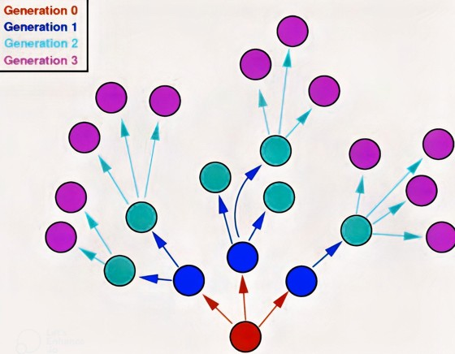
<!-- Image illustrative pour introduire le sujet -->

---

## 2. Modèle S.I.R.
<!-- Partie consacrée au modèle déterministe classique basé sur les équations différentielles -->

### 2.1 Présentation
<!-- Définition des variables du modèle SIR -->

Le modèle S.I.R. divise la population en trois groupes :
- **S(t)** : les individus sains
- **I(t)** : les individus infectés
- **R(t)** : les individus rétablis (et immunisés)

> Hypothèses :
<!-- Liste des hypothèses simplificatrices du modèle SIR -->
- Immunité acquise après guérison
- Pas de décès pris en compte
- Population de taille constante

> 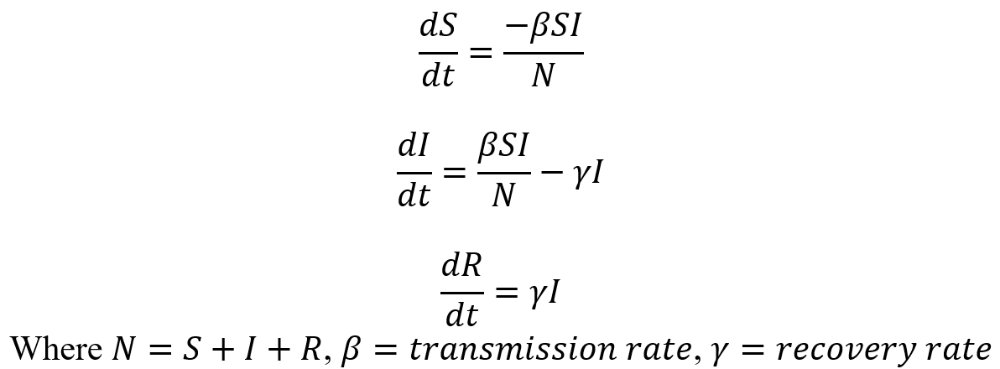
<!-- Schéma montrant les transitions entre états -->

---

### 2.2 Données expérimentales
<!-- Exemple réel utilisé pour calibrer et illustrer le modèle -->

- Zone d'étude : **Casablanca (Maroc)**
- Période : **1er mai – 31 octobre**
- Population : **3,7 millions**

Sources :
- Service des maladies infectieuses de Casablanca
- Site Covid Maroc 360

> 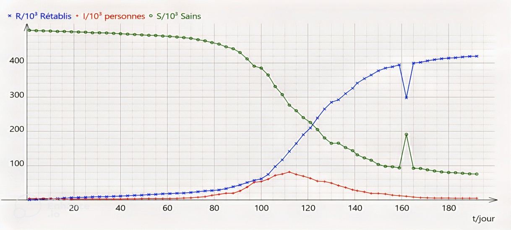
<!-- Graphique montrant les données expérimentales utilisées -->

---

### 2.3 Estimation des paramètres β et γ
<!-- Méthode de calcul des paramètres essentiels du modèle -->

#### Transmission β grâce à une regréssion linéaire
<!-- Estimation de β à partir de S' et S×I -->

> 

#### Guérison γ
<!-- Estimation de γ à partir de R' et I -->

> ![Rprime vs I](./Images/
<!-- Image manquante ou lien à corriger -->

---

### 2.4 Simulation numérique en Python
<!-- Détails sur l'implémentation informatique du modèle SIR -->

- Bibliothèques : `scipy`, `numpy`, `matplotlib`
- Intégration du système d’EDO avec `odeint`

> 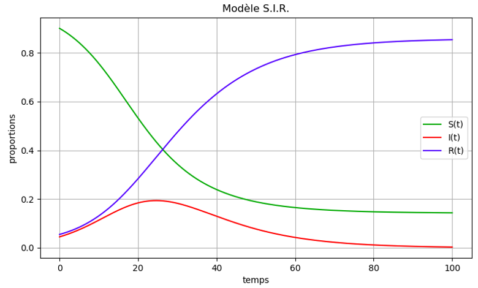
<!-- Exemple de résultat simulé en Python -->

---

### 2.5 Constante R₀ et interprétation
<!-- Calcul de la constante épidémique et son importance -->

- **R₀ = β / γ** représente le nombre moyen de contaminations causées par un individu infecté : exemple avec Un R₀ <1, l'épidémie ne progresse pas.

> 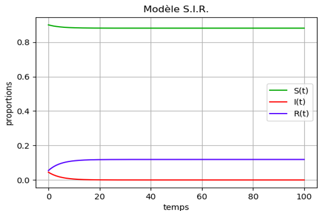
<!-- Visualisation de l’évolution du taux de contamination -->

---

### 2.6 Prévention
<!-- Liens entre les mesures sanitaires et les paramètres du modèle -->

- **Distanciation sociale** → réduction de β
- **Traitements médicaux** → augmentation de γ

---

## 3. Modèle basé sur les automates cellulaires
<!-- Deuxième modèle, basé cette fois sur une approche probabiliste et visuelle -->

### 3.1 Jeu de la vie
<!-- Rappel du principe de base des automates cellulaires -->

Principe :
- Grille 2D où chaque cellule est en état **mort** (0) ou **vivant** (1)
- Règles de transition simples :
  - Naissance : 3 voisines vivantes
  - Survie : 2 ou 3 voisines
  - Sinon : mort

> 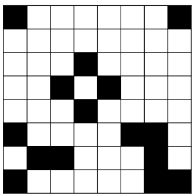

---

### 3.2 Adaptation au modèle épidémique
<!-- Traduction des états classiques en états épidémiques -->

Chaque cellule peut être :
- **S** (vert) : Sain
- **I** (rouge) : Infecté
- **R** (bleu) : Rétabli
- **D** (noir) : Décédé

> 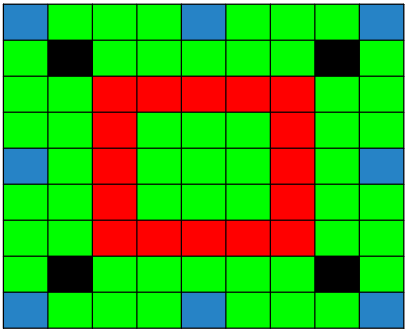
<!-- Grille initiale avec un état SIRD -->

---

### 3.3 Règles de transition
<!-- Probabilités associées aux changements d'état -->

> 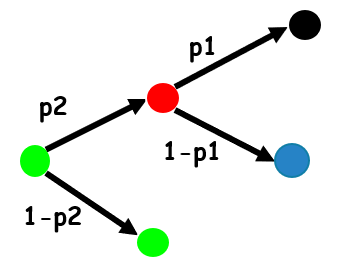

- **S → I** si voisin infecté, avec probabilité **p₂**
- **I → D** avec **p₁**, ou **I → R** avec **1–p₁**
- **R** et **D** sont des états stables

---

### 3.4 Schéma algorithmique
<!-- Algorithme général de simulation -->

> 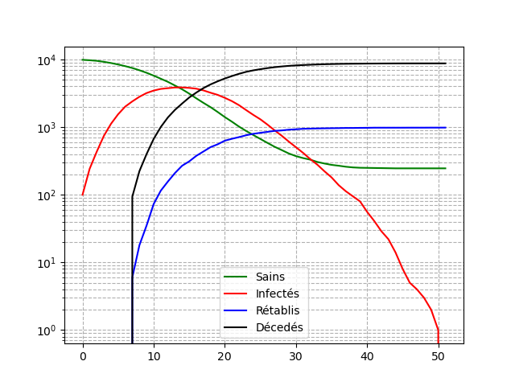

---

### 3.5 Résultats de simulation
<!-- Résultat visuel et numérique de l'évolution de l'automate -->

> 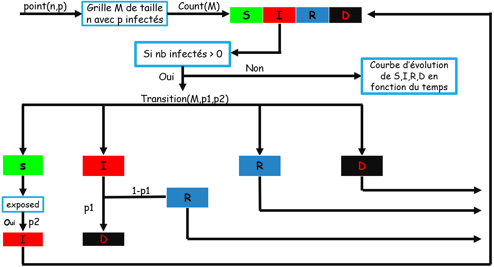

---

### 3.6 Amélioration : temps d’incubation
<!-- Ajout d'une notion de délai dans la contamination -->

> Intégration du temps d'incubation dans la matrice de contagiosité

> 

> 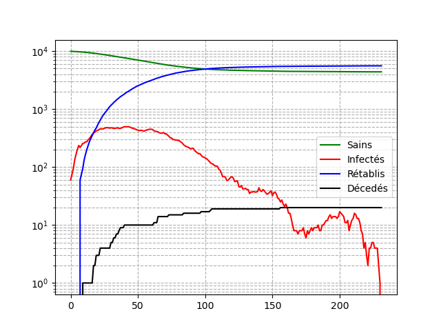

---

## 4. Annexe
<!-- Codes sources utilisés pour les simulations -->

### 4.1 Code Python – Modèle SIR

```python
# Code Python
def SIR_model(y, t, beta, gamma):
    S, I, R = y
    dS_dt = -beta * S * I
    dI_dt = beta * S * I - gamma * I
    dR_dt = gamma * I
    return [dS_dt, dI_dt, dR_dt]
